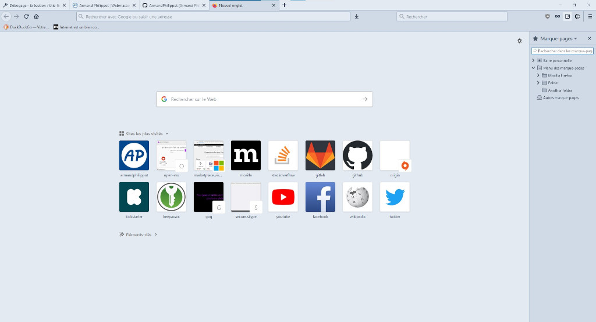
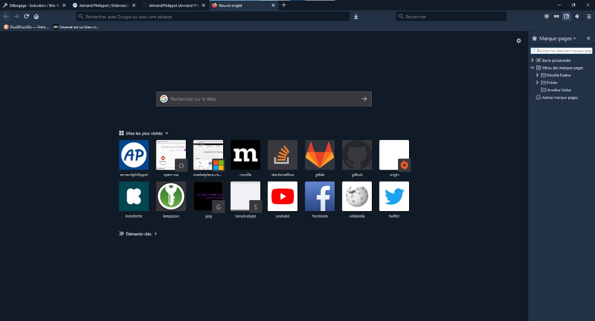
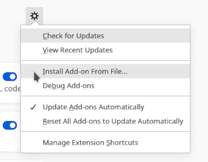

    

# Coldark Firefox

 

An optimized theme for web development that comes with two versions: light & dark.

## Presentation

Coldark is a gray-blue theme. The colors used respect the Web Content Accessibility Guidelines (WCAG) in order to provide sufficient reading comfort. However, with opacity, it is possible that some contrasts are diminished and that they are above level AA.

This version is designed for [Firefox](https://www.mozilla.org/fr/firefox/).

## Colors

Coldark consists of three color palettes. The first is common to both versions. The other two each apply to a version.

In Coldark for Firefox, each versions only use 7 colors. Some elements do not seem customizable like the tab hover or the search box on the new tab page.

### Light Theme

| Hex Code | Preview | Description | Denomination |
| :-: | :-: | --- | :-: |
| `#e3eaf2` | ![#e3eaf2][#e3eaf2] | **Default background** - Frame, new tab page, fields | `coldark00` |
| `#d0dae7` | ![#d0dae7][#d0dae7] | **Dark background** - Selected tab, toolbar, sidebar | `coldark01` |
| `#8da1b9` | ![#8da1b9][#8da1b9] | **Darker background** - Inactive frame, highlight, borders | `coldark02` |
| `#213043` | ![#213043][#213043] | **Lighter foreground** – Icons, new tab page, popup, highlight, fields, inactive tab. | `coldark04` |
| `#111b27` | ![#111b27][#111b27] | **Default foreground** - Selected tab, toolbar | `coldark05` |
| `#f0f4f8` | ![#f0f4f8][#f0f4f8] | **Lighter background** – Popup, focused fields, buttons states | `coldark07` |
| `#005a8e` | ![#005a8e][#005a8e] | **Blue** - Special icons (e.g. bookmark), focus border, selected tab border, tab loading, field highlight | `coldark10` |

### Dark Theme

| Hex Code | Preview | Description | Denomination |
| :-: | :-: | --- | :-: |
| `#111b27` | ![#111b27][#111b27] | **Default background** – Frame, new tab page, fields | `coldark00` |
| `#213043` | ![#213043][#213043] | **Light background** - Selected tab, toolbar, sidebar | `coldark01` |
| `#3c526d` | ![#3c526d][#3c526d] | **Lighter background** - Popup, focused fields, buttons states | `coldark02` |
| `#d0dae7` | ![#d0dae7][#d0dae7] | **Dark foreground** – Icons, new tab page, popup, highlight, fields, inactive tab. | `coldark04` |
| `#e3eaf2` | ![#e3eaf2][#e3eaf2] | **Default foreground** - Selected tab, toolbar | `coldark05` |
| `#0b121b` | ![#0b121b][#0b121b] | **Dark background** - Inactive frame, highlight, borders | `coldark07` |
| `#6cb8e6` | ![#6cb8e6][#6cb8e6] | **Blue** - Special icons (e.g. bookmark), focus border, selected tab border, tab loading, field highlight | `coldark10` |

## Features

- Detect if user prefer dark scheme and apply dark version.
- Icon in navbar for switch between versions.
- Shortcut (default: `Alt+T`) for switch between versions.

If the shortcut doesn't work, make sure it is not used by another extension. If so, change it to either Coldark or the other extension.

## Screenshots

| Cold | Dark |
| :-: | :-: |
|  |  |

## Install

1. Download Coldark for Firefox
2. Open Addons menu (e.g. `about:addons`)
3. Select "_Extensions_"
4. Click on the gear icon ; you should see "_Install Add-on from file..._"
5. Select the `xpi` file

## License

This project is open source and available under the [MIT License](https://github.com/ArmandPhilippot/coldark-firefox/blob/master/LICENSE).

<!-- REFERENCES -->

<!-- UI Colors -->

[#f0f4f8]: https://placehold.it/20/f0f4f8/000000?text=+
[#e3eaf2]: https://placehold.it/20/e3eaf2/000000?text=+
[#d0dae7]: https://placehold.it/20/d0dae7/000000?text=+
[#8da1b9]: https://placehold.it/20/8da1b9/000000?text=+
[#3c526d]: https://placehold.it/20/3c526d/000000?text=+
[#213043]: https://placehold.it/20/213043/000000?text=+
[#111b27]: https://placehold.it/20/111b27/000000?text=+
[#0b121b]: https://placehold.it/20/0b121b/000000?text=+

<!-- Syntax - Light Theme Colors -->

[#c70100]: https://placehold.it/20/c70100/000000?text=+
[#116b00]: https://placehold.it/20/116b00/000000?text=+
[#755f00]: https://placehold.it/20/755f00/000000?text=+
[#005a8e]: https://placehold.it/20/005a8e/000000?text=+
[#af00af]: https://placehold.it/20/af00af/000000?text=+
[#006d6d]: https://placehold.it/20/006d6d/000000?text=+
[#7c00aa]: https://placehold.it/20/7c00aa/000000?text=+
[#a04900]: https://placehold.it/20/a04900/000000?text=+

<!-- Syntax - Dark Theme Colors -->

[#f57a73]: https://placehold.it/20/f57a73/000000?text=+
[#91d076]: https://placehold.it/20/91d076/000000?text=+
[#e6d37a]: https://placehold.it/20/e6d37a/000000?text=+
[#6cb8e6]: https://placehold.it/20/6cb8e6/000000?text=+
[#f4adf4]: https://placehold.it/20/f4adf4/000000?text=+
[#66cccc]: https://placehold.it/20/66cccc/000000?text=+
[#c699e3]: https://placehold.it/20/c699e3/000000?text=+
[#e9ae7e]: https://placehold.it/20/e9ae7e/000000?text=+
